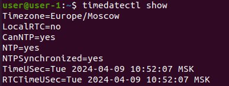

## Part 1. Установка ОС

- Устанавливаем Ubuntu 20.04 Server LTS на виртуальную машину с использованием программы VirtualBox.
- Версия Linux: Ubuntu 20.04.6 LTS.
- Выполнение команды `cat etc/issue`:

.png "Выполнение команды cat etc/issue")

## Part 2. Создание пользователя
- Вызов команды для создания пользователя (флаг `-m` говорит системе создать отдельную директорию с именем пользователя для хранения его файлов):

.jpg "Вызов команды для создания пользователя")
- Вызов команды для добавления пользователя в группу adm:

.png "Вызов команды для добавления пользователя в группу adm")
- Часть вывода команды `cat /etc/passwd` с содержанием информации о созданном пользователе:

.png "Часть вывода команды cat /etc/passwd с содержанием информации о созданном пользователе")

## Part 3. Настройка сети ОС
- Для смены названия машины (hostname) открываем файл `/etc/hostname` с правами суперпользователя командой:

.png "Для смены названия машины (hostname) открыл файл /etc/hostname с правами суперпользователя")
- После перезагрузки название машины изменилось на новое. Проверка названия машины с помощью команды `hostname`:

.png "Проверка названия машины с помощью команды hostname")
- Установка временной зоны с помощью утилиты `timadatectl` и проверка:

.png "Установка временной зоны с помощью утилиты timadatectl. Проверка установленной временной зоны.")

- Установка стандартного набора сетевых утилит с помощью команды `sudo apt get install net-tools`
- Вывод данных сетевых интерфейсов с помощью команды `ifconfig`:

.png "Вывод данных сетевых интерфейсов с помощью команды ifconfig")
- Loopback-интерфейс ( lo ) часто используется для тестирования сетевых приложений. Он позволяет создавать виртуальные сетевые интерфейсы и эмулировать различные сетевые сценарии без реального оборудования. Название интерфейса ( обратная петля ) обусловлено тем, что если исходящий от программы пакет имеет адресат 127.0.0.1 ( стандартный для lo-интерфейса ), то данный пакет направляется машиной не в сеть, а себе же на вход.
- Узнаем ip-адрес устройства с помощью команды `hostname -I`:

.png "Узнаем ip-адрес устройства с помощью команды hostname -I")
- DHCP (Dynamic Host Configuration Protocol — протокол динамической настройки узла) — сетевой протокол, позволяющий сетевым устройствам автоматически получать IP-адрес и другие параметры, необходимые для работы в сети TCP/IP. Данный протокол работает по модели «клиент-сервер». Для автоматической конфигурации компьютер-клиент на этапе конфигурации сетевого устройства обращается к так называемому серверу DHCP и получает от него нужные параметры. Сетевой администратор может задать диапазон адресов, распределяемых сервером среди компьютеров. Это позволяет избежать ручной настройки компьютеров сети и уменьшает количество ошибок. 
- Определяем внешний ip-адрес шлюза с помощью команды `wget -qO - ifconfig.me`, внутренний ip-адрес шлюза определяем с помощью команды `ip route` (в выводе этой команды адрес находится в первой строке после "default via"):

.png "Определение внешнего и внутреннего адресов шлюза")
.png "ip route")
- для задания статичных ip, gw и DNS открываем для редактирования конфигурационный файл Netplan с правами суперпользователя

- Изначальное содержимое конфигурационного файла Netplan:

.png "Изначальное содержимое конфигурационного файла Netplan")
- Отключаем DHCP, определяем статически ip,gw и DNS. Содержание измененного конфигурационного файла Netplan:

.png "Содержание измененного конфигурационного файла Netplan")
- После перезагрузки виртуальной машины смотрим, соответствуют ли настройки системы заданным в предыдущем пункте параметрам. Вывод ip и gw:

.png "Вывод ip и gw:")
- Часть вывода команды `resolvectl status`, содержащая информацию об используемых DNS серверах:

.png "Часть вывода команды resolvectl status, содержащая информацию об используемых DNS серверах")
- Пинг сервера 1.1.1.1:

.png "Пинг сервера 1.1.1.1")

## Part 4. Обновление ОС
- Обновляем системные пакеты до последней на момент выполнения задания версии. Сообщение после попытки повторного обновления пакетов:

.png "Сообщение после попытки повторного обновления пакетов")

## Part 5. Использование команды sudo
- Команда `sudo` в Linux означает "SuperUser Do" (Выполнить действие от имени суперпользователя). Это утилита, которая позволяет пользователям выполнять команды с правами администратора. Когда вы запускаете команду с помощью sudo, вы должны ввести пароль для текущего пользователя, чтобы аутентифицировать выполнение конкретной команды.   
Команда `sudo` позволяет пользователям выполнять привилегированные операции, такие как установка программ, изменение системных настроек, и так далее. Она работает, запуская переданную ей команду от имени суперпользователя.
- Для того, чтобы пользователь new_user имел право выполнят команды от имени суперпользователя, открываем файл sudoers.tmp с помощью команды `sudo visudo` (делаем это от имени пользователя, который имеет на это права), находим там необходимую строку.

- Добавляем после нее строку, содержащую имя пользователя (в моем случае new_user) и команду `ALL=(ALL:ALL) ALL`:
.jpg "Строка с правами доступа из файла sudoers.tmp. Добавляем после нее строку, содержащую имя пользователя (в моем случае user1) и команду `ALL=(ALL:ALL) ALL`")

- Заходим в систему под пользователем new_user. Изменяем hostname при помощи команды `sudo hostnamectl set-hostname` и сразу проверяем, что изменение вступило в силу:

.png "Изменяем hostname при помощи команды sudo hostnamectl set-hostname и сразу проверяем, что изменение вступило в силу")

## Part 6. Установка и настройка службы времени
- Результат выполнения команды `timedatectl show`:

## Part 7. Установка и использование текстовых редакторов
### Создание, редактирование и выход с сохранением изменений.
#### VIM
- Редактор  VIM был предустановлен в ОС.
- Создаём файл test_VIM.txt:

.png "Создаём файл test_VIM.txt")
- После выполнения данной команды создается файл и открывается редакторе VIM. Для перехода в режим ввода нажимаем клавишу `i`.
- Содержание файла test_VIM.txt перед закрытием:

.png "Содержание файла test_VIM.txt перед закрытием")
- После окончания ввода текста, для выхода из режима редактирования нажимаю ESC. Для сохранения и выхода ввожу `:wq` (w(write) - записать изменения, q(quit) - выйти).
#### NANO
- Редактор NANO был предустановлен в ОС.

.png "Запускаем редактор с помощью команды nano.")
- Содержание файла test_NANO.txt перед закрытием:

.png "Содержание файла test_NANO.txt перед закрытием")
- Для сохранения нажимаем `Ctrl+O`, для выхода из редактора нажимаем `Ctrl+X`.
#### JOE
- Устанавливаем текстовый редактор JOE с помощью команды `sudo apt install joe`.
.png "Устанавливаем редактор с помощью команды `sudo apt install joe`.")
- Запускаем редактор командой `joe`
- Содержание файла test_JOE.txt перед закрытием:

.png "Содержание файдла test_JOE.txt перед закрытием")
- Для выхода с сохранением нажимаем `Ctrl+k+x`.
### Редактирование и выход без сохранения
#### VIM
- Содержание файла test_VIM.txt после редактирования:

.png "Содержание файла test_VIM.txt после редактирования")
- Для выхода из редактора без сохранения в командном режиме набираем `:q!`
#### NANO
- Содержание файла test_NANO.txt после редактирования:

.png "Содержание файла test_NANO.txt после редактирования")
- Для выхода без сохранения нажимаем `Ctrl+x`, система спрашивает, нужно ли сохранить файл перед выходом, вводим `n`.
#### JOE
- Содержание файла test_JOE.txt после редактирования:

.png)
- Для выхода без сохранения нажимаем `Ctrl+c` и на вопрос редактора `"Lose changes to this file?"` вводим `y`.
### Поиск по содержимому и замена
#### VIM
- Для поиска в командном режиме вводим `/<искомое значение>`, в данном случае /School. Дальнейшее переключение между результатами производится вводом n (следующее значение) и N (предыдущее значение). Результат поиска:

.png "Результат поиска подстроки \"School\"")
- Общая форма команды замены : `:[range]s/{pattern}/{string}/[flags] [count]`

- Для замены во всем файле подстроки `"School"` на подстроку `"University"` в командном режиме вводим: ( % - поиск и замена во всех строках, g поиск и замена всех совпадений, не только первого).

.png "Замена во всем файле подстроки `School` на подстроку `University` в командном режиме")

- Результат замены в файле `test_VIM.txt`:

.png "Результат замены в файле `test_VIM.txt`")
#### NANO
- Для поиска нажимаем `Ctrl+w`, далее вводим искомое выражение и `Enter`, программа перемещает курсор в начало искомого выражения. Для поиска следующего вхождения данного выражения используется сочетание клавиш `Alt+w` (`Option+w` для mac). Для поиска предыдущего - `Alt+q` (`Option+q`).
- Результат поиска подстроки "School":

.png "Результат поиска подстроки \"School\"")
- Для поиска и замены используется сочетание клавиш `Ctrl+\`. Далее вводим выражение, которое требуется заменить и выражение, на которое заменяем. Для замены во всем файле нажимаем `a`.
- Результат замены выражения `School` на `University`:

.png "Результат замены выражения `School` на `University`")
#### JOE
- Для поиска нажимаем `Ctrl+k`, вводим `f`, далее вводим искомое выражение, нажимаем `Enter`, вводим `i` (ingnore), программа устанавливает курсор на символ, следующий за окончанием искомого выражения. Для переключения к следующему результату поиска нажимаем `Ctrl+l`.
- Результат поиска подстроки "School"

.png "Результат поиска подстроки \"School\"")
- Для поиска и замены так же нажимаем `Ctrl+k`, вводим `f`, далее вводим искомое выражение, `Enter`, `r`, `Enter`, вводим выражение для замены, `Enter`. Для замены во всем файле вводим `r` и `Enter`.
- Результат замены выражения `School` на `University`:

.png "Результат замены выражения `School` на `University`")

## Part 8. Установка и базовая настройка сервиса SSHD
- SSHd является компонентом OpenSSH. Для установки OpenSSH используем команду `sudo apt install open-ssh server`. Далее проверяем, работает ли служба с помощью команды `sudo systemctl status ssh`:

.png "Вывод результата команды `sudo apt install open-ssh`")
.png "Вывод результата команды `sudo systemctl status ssh`")
- Добавление автостарта службы SSHd при загрузке системы:

.png "Добавление автостарта службы SSHd при загрузке системы")
- Для перенастройки службы SSHd на порт 2022 открываем файл `/etc/ssh/sshd_config` и находим строку `#Port 22`, изменяем её на `Port 2022` ( обязательно убираем знак `#`), затем перезапускаем службу SSHd командой `sudo systemctl restart sshd`.

.png "Изменение файла sshd_config")
- Чтобы показать наличие процесса при помощи команды `ps` используем флаг `-C` ( этот флаг выводит список всех процессов с указанным именем ):

.png "Определение наличия процесса sshd при помощи флага `ps`")
- Вывод команды `netstat -tan`:

.png)
- Kоманда `netstat` с ключем `-tan` отображает все активные TCP-соединения и прослушиваемые TCP-порты, используя числовые идентификаторы портов.  Этот ключ включает в себя три отдельных ключа:
  - `-t` : Этот ключ указывает `netstat` отобразить только TCP-соединения.
  - `-a` : Этот ключ указывает `netstat` отобразить все соединения и прослушиваемые порты.
  - `-n` : Этот ключ указывает `netstat` отобразить номера портов вместо их имен.
- Значение столбцов в выводе команды `netstat -tan`:
  - `Proto` : Протокол, который используется для соединения. 
  - `Recv-Q` : Очередь приема байтов, полученных или готовых к приему.
  - `Send-Q` : Очередь отправки байтов, которые еще не были отправлены.
  - `Local Address` : Адрес и порт локальной стороны соединения.
  - `Foreign Address` : Адрес и порт удаленной стороны соединения.
  - `State` : Состояние соединения. В данном случае, это может быть `LISTEN` (слушание), `ESTABLISHED` (соединение установлено), `CLOSE_WAIT` (ожидание закрытия соединения) и другие.
- В контексте команды `netstat -tan`, если 0.0.0.0 появляется в столбце `Local Address`, это означает, что порт прослушивается на всех сетевых интерфейсах компьютера. Если 0.0.0.0 появляется в столбце `Foreign Address`, это означает, что соединение может быть установлено с любого IP-адреса.

## Part 9. Установка и использование утилит top, htop
- Вывод на экран команды `top`:

.png "Вывод на экран команды `top`")
  - uptime: 9:33 минут.
  - количество авторизованных пользователей: 1.
  - общая загрузка системы: 0.08, 0.03, 0.00.
  - общее количество процессов: 321.
  - загрузка CPU: 
    + 1.3 Us: 1.3% времени процессора занято пользовательскими процессами.
    + 0.1 sy: 0.1% времени процессора занято системными процессами.
    + 0.0 ni: 0.0% времени процессора занято процессами с приоритетом ниже нормального.
    + 98.7 id: 98.7% времени процессора простаивает, т.е. не используется.
    + 0.0 wa: 0.0% времени процессора ждет ввода-вывода.
    + 0.0 hi: 0.0% времени процессора ждет обработки аппаратных прерываний.
    + 0.0 si: 0.0% времени процессора ждет обработки программных прерываний.
    + 0.0 st: 0.0% времени процессора занято виртуализацией.
  - общий объем оперативной памяти составляет 3876.5 MiB, из которых 486.1 MiB свободны, 1046.8 MiB используются, и 2343.6 MiB используются для буферизации и кэширования.
  - pid процесса занимающего больше всего памяти: 1666
  - pid процесса, занимающего больше всего процессорного времени: 806.
- Вывод команды `htop`:
  - отсортированный по `PID`:
  
  .png "отсортированный по `PID`")
  - отсортированный по `PERCENT_CPU`:
  
  .png "отсортированный по `PERCENT_CPU`")
  - отсортированный по `PERCENT_MEM`:
  
  .png "отсортированный по `PERCENT_MEM`")
  - отфильтрованный для процесса `sshd`:
  
  .png "отфильтрованный для процесса `sshd`")
  - с процессом `syslog`, найденным, используя поиск:
  
  .png "с процессом syslog, найденным, используя поиск")
  - с добавленным выводом `hostname`, `clock` и `uptime`:
  
  .png "с добавленным выводом `hostname`, `clock` и `uptime`")

  ## Part 10. Использование утилиты fdisk
- Вывод команды fdisk -l:

.png "Вывод команды fdisk -l")
.png "Вывод команды fdisk -l")
  - Название жесткого диска : a.
  - Размер жесткого диска : 20 ГБ.
  - Количество секторов : 4194091.
  - swap-раздел или swap-файл отсутствует.
## Part 11. Использование утилиты df
- Вывод команды `df`:

.png "Вывод команды `df`")
  - Размер раздела : 19947120 килобайта.
  - Размер занятого пространства : 8524700 килобайт.
  - Размер свободного пространства : 10383828 килобайта.
  - Использовано 46%.
- Вывод команды `df -Th`:

.png)
  - Размер раздела : 20 Гб.
  - Размер занятого пространства : 8.2 Гб.
  - Размер свободного пространства : 10 Гб.
  - Использовано 46%.
## Part 12. Использование утилиты du
- Размер папок /home, /var, /var/log (в байтах, в человекочитаемом виде):

.png "Размер папок /home, /var, /var/log (в байтах, в человекочитаемом виде)")
- Размер всего содержимого в /var/log:

.png "Размер всего содержимого в /var/log")
## Part 13. Установка и использование утилиты ncdu
- Для установки утилиты используем команду `sudo apt install ncdu`.
- Вывод утилиты `ncdu`, на котором видны размеры каталогов `/home` и `/var`:

.png "Вывод утилиты `ncdu`, на котором видны размеры каталогов `/home` и `/var`")
- Вывод утилиты `ncdu`, на котором виден размер каталога `var/log`:

.png "Вывод утилиты `ncdu`, на котором виден размер каталога `var/log`")
## Part 14. Работа с системными журналами
- Часть вывода файла `/var/log/auth.log`, по которой видно, что время последней успешной авторизации 12:04:11, имя пользователя `gdm`, вход был совершен по логину:

.png "Часть вывода файла `/var/log/auth.log`, по которой видно, что время последней успешной авторизации 12:04:11, имя пользователя `gdm`, вход был совершен по логину")
- Часть файла `var/log/syslog`, с сообщениями о перезапуске службы SSHd:

.png "Часть файла `var/log/syslog`, с сообщениями о перезапуске службы SSHd")
## Part 15. Использование планировщика заданий CRON
- Для создания задачи в планировщике CRON - открываем файл с помощью команды `ctrontab -e`. В открывшемся файле добавляем строку с периодичностью исполнения и путем к исполняемой команде. В нашем случае строка будет иметь вид:

.png "Строка из конфигурационного файла CRON, выполняющего команду uptime каждые 2 минуты")
- Часть содержания файла `/var/log/syslog`, содержащая информацию о выполнении команды `uptime`:

.png "Часть содержания файла `/var/log/syslog`, содержащая информацию о выполнении команды `uptime`")

- Удаление всех задач и вывод текущих задач для CRON:

.png "Удаление всех задач и вывод текущих задач для CRON")